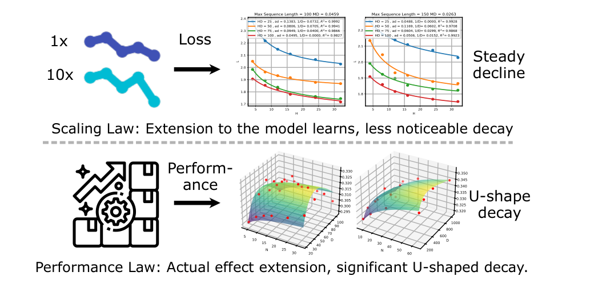
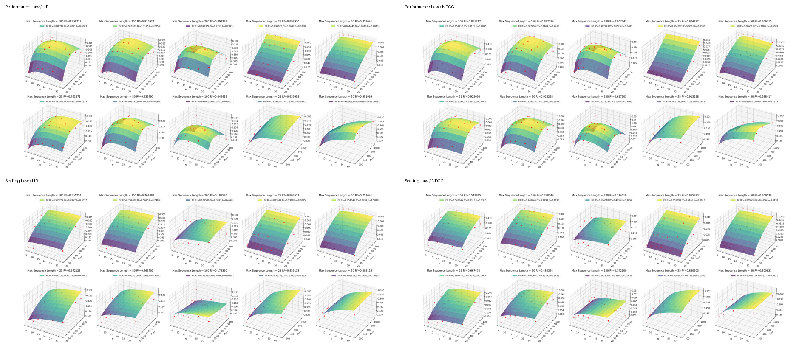

# P-Law: Predicting Quantitative Scaling Law with Entropy Guidance in Large Recommendation Models

[](https://ustc-starteam.github.io/P-Law/)
[](https://neurips.cc/virtual/2025/loc/san-diego/poster/119100)
[](https://openreview.net/forum?id=En1F2gjza6)
[](https://www.python.org/)

Official code for **"P-Law: Predicting Quantitative Scaling Law with Entropy Guidance in Large Recommendation Models"**.

This repository studies why loss-oriented scaling laws do not directly transfer to large recommendation models, and introduces **P-Law** to predict ranking performance under varied model, data, and training settings. The codebase contains the entropy utility, transformer-based recommendation training code, and appendix scripts/frameworks used to fit and visualize the reported performance laws.

## 1. Paper

Tingjia Shen, Hao Wang, Chuhan Wu, Jin Yao Chin, Wei Guo, Yong Liu, Huifeng Guo, Defu Lian, Ruiming Tang, and Enhong Chen. **P-Law: Predicting Quantitative Scaling Law with Entropy Guidance in Large Recommendation Models.** NeurIPS 2025 Poster, San Diego, USA, 2025.

[OpenReview](https://openreview.net/forum?id=En1F2gjza6) / [NeurIPS Virtual Poster](https://neurips.cc/virtual/2025/loc/san-diego/poster/119100) / [Slides PDF](https://neurips.cc/media/neurips-2025/Slides/119100.pdf) / [Video](https://slideslive.com/39047036) / [Poster Image](https://neurips.cc/media/PosterPDFs/NeurIPS%202025/119100.png?t=1762758210.729176) / [Project Page](https://ustc-starteam.github.io/P-Law/) / [Citation](#citation)

P-Law predicts large recommendation model performance instead of only describing qualitative scaling trends. It introduces an entropy-guided data-quality signal to reduce the effect of redundant user sequences, models the gap between loss and ranking performance, and supports practical uses such as optimal-parameter prediction and model-expansion potential analysis.

NeurIPS 2025 materials:

- Session: Wednesday, December 3, 2025, 11:00 AM - 2:00 PM PST.
- Presentation video: [SlidesLive 39047036](https://slideslive.com/39047036).
- Slides/PPT material: [official NeurIPS slides PDF](https://neurips.cc/media/neurips-2025/Slides/119100.pdf).
- Poster asset: [official NeurIPS poster image](https://neurips.cc/media/PosterPDFs/NeurIPS%202025/119100.png?t=1762758210.729176).

## 2. Highlights

- Predicts quantitative performance for large recommendation models across model scale, data settings, and training choices.
- Uses entropy guidance to measure data quality and reduce the influence of redundant, low-information user sequences.
- Models the loss-performance discrepancy so scaling analysis better reflects ranking metrics such as HR and NDCG.
- Provides reusable components for entropy estimation, transformer-based recommendation experiments, and appendix fitting/visualization.

## 3. Method At A Glance



The paper contrasts conventional scaling-law behavior with the recommendation-specific P-Law. Instead of expecting larger models or more data to monotonically improve performance, the fitted surfaces expose where HR/NDCG improve, saturate, or decay under different sequence lengths, model depths, embedding dimensions, and entropy-guided data-quality parameters.

## 4. Repository Structure

```text
.
|-- PerformanceLaw/                         # Python package for actual entropy / sequence-complexity estimation
|-- General_Transformer/                    # Transformer training and evaluation code for sequential recommendation
|-- Performance_Law_Appendix_Result/        # Performance-law fitting scripts and generated appendix result figures
|-- Performance_Law_Appendix_Framework/     # Additional baseline/framework code used in appendix experiments
|-- docs/assets/                            # README figures cropped or converted from the paper/results
|-- .gitattributes                          # Git LFS tracking for large data files
`-- README.md
```

## 5. Installation

Clone the repository with Git LFS enabled when you need the large tracked data files:

```bash
git clone https://github.com/USTC-StarTeam/P-Law.git
cd P-Law
git lfs pull
```

Install the entropy utility:

```bash
pip install -e PerformanceLaw
```

Install dependencies for the transformer experiments:

```bash
cd General_Transformer
pip install -r requirements.txt
```

## 6. Data

Some data files under `General_Transformer/data/` are tracked with Git LFS. If a large file is unavailable from LFS, prepare the corresponding recommendation dataset manually before launching full-scale experiments. The training code expects preprocessed sequential data paths to match the path settings used inside `General_Transformer/main.py`.

Appendix frameworks under `Performance_Law_Appendix_Framework/` may follow their original dataset conventions. Read the local README inside each framework directory before running those baselines.

## 7. Quick Start

Estimate the actual entropy of a short sequence:

```python
from PerformanceLaw import actual_entropy, actual_entropy_tq

sequence = [1, 2, 1, 2, 3]
print(actual_entropy(sequence))
print(actual_entropy_tq(sequence))  # progress-bar version for longer sequences
```

Run a transformer experiment:

```bash
cd General_Transformer
torchrun --standalone --nproc_per_node=1 main.py --model_name llama --n_layers 8 --n_heads 8 --batch_size 32
```

Use `--eval_only` with `--ckpt_name` to evaluate an existing checkpoint.

## 8. Reproducing Paper Results

Train or evaluate the sequential recommendation backbone from `General_Transformer/`, then fit the law surfaces from the appendix result directory:

```bash
cd Performance_Law_Appendix_Result
python performance_law_fitting.py
```

The fitting script prepares metric matrices, normalizes them, fits the parametric Performance Law, reports fitting quality, and generates 3D visualizations for HR/NDCG.

## 9. Configuration Notes

Important arguments in `General_Transformer/main.py` include:

- `--model_name`: `llama` or `hstu`
- `--n_layers`: number of transformer layers
- `--n_heads`: number of attention heads
- `--batch_size`: training batch size
- `--out_dir`: checkpoint and log directory
- `--deepspeed`: optional DeepSpeed configuration path

Adjust dataset paths in the training script before launching large experiments.

## 10. Experimental Highlights



### 10.1 Scaling-Law Fit

The paper first checks whether recommendation loss follows a scaling-law trend. On MovieLens-1M, Amazon Books, KuaiRand-pure, and Huawei Music, the fitted curves report coefficient-of-determination values above 0.95, supporting the use of scale-aware analysis before moving to ranking metrics.

**Conclusion:** the loss surface is regular enough to support law fitting, but loss alone is not sufficient to explain ranking quality.

### 10.2 Performance-Law Fit

P-Law then fits HR@10 and NDCG@10 with model depth, embedding dimension, and data-quality terms. The fitted surfaces in Figure 3 track non-monotonic behavior that simpler scaling-law surfaces can miss.

**Conclusion:** recommendation performance depends jointly on model scale and data quality; increasing parameters is not always monotonic once ranking metrics are considered.

### 10.3 Data Quality Signal

The paper links the fitted data parameter to `tokens / ApEn`, where Approximate Entropy (ApEn) is used as a dataset-quality signal. The linear relationships in Figure 4 appear consistently across the evaluated datasets.

**Conclusion:** P-Law gives a practical way to compare candidate model/data configurations instead of treating token count as the only scale variable.

## 11. Notes For Maintainers

- Keep the top-level README focused on the paper story and runnable entry points; place framework-specific details in each subdirectory.
- Do not remove Git LFS tracking without replacing the large data workflow.
- When adding new appendix figures, store README-ready images under `docs/assets/` and keep original experiment artifacts in their source directories.

<a id="citation"></a>

## 12. Citation

```bibtex
@inproceedings{shen2025plaw,
  title = {P-Law: Predicting Quantitative Scaling Law with Entropy Guidance in Large Recommendation Models},
  author = {Shen, Tingjia and Wang, Hao and Wu, Chuhan and Chin, Jin Yao and Guo, Wei and Liu, Yong and Guo, Huifeng and Lian, Defu and Tang, Ruiming and Chen, Enhong},
  booktitle = {Advances in Neural Information Processing Systems},
  year = {2025},
  url = {https://openreview.net/forum?id=En1F2gjza6}
}
```

## 13. Contact

For paper questions, please contact:

- First author: Tingjia Shen (`jts_stj@mail.ustc.edu.cn`)
- Corresponding authors: Hao Wang (`wanghao3@ustc.edu.cn`) and Enhong Chen (`cheneh@ustc.edu.cn`)

For repository issues, please open a GitHub issue in this repository.
